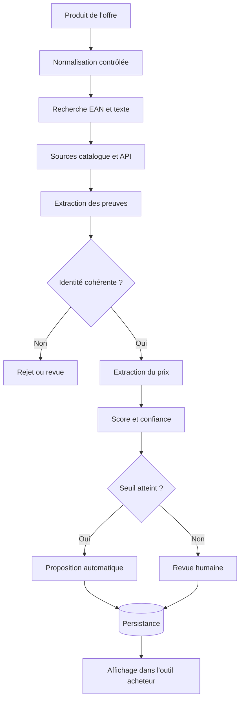

# Architecture simplifiée : recherche PMC



## Responsabilités

| Brique | Responsabilité |
| --- | --- |
| Collecte | Obtenir plusieurs candidats auprès de sources différentes. |
| Normalisation | Comparer des textes et formats exprimés différemment. |
| Filtres | Rejeter les incompatibilités certaines. |
| Scoring | Agréger des preuves d'identité explicables. |
| Extraction | Lire le prix du candidat validé. |
| Persistance | Conserver le résultat, sa source et sa confiance. |
| Revue | Permettre à un acheteur de trancher les cas ambigus. |

## Point de conception principal

```text
Identité du produit d'abord → prix ensuite
```

Le système évite de choisir un candidat uniquement parce que son prix semble plausible.

