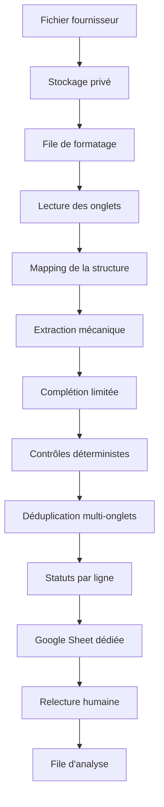
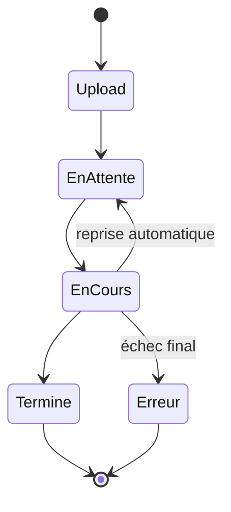

# Architecture simplifiée : auto-formatage



## Répartition des responsabilités

| Acteur | Rôle |
| --- | --- |
| IA | Lire une structure nouvelle et proposer un mapping. |
| Code | Copier les cellules, normaliser et vérifier. |
| Acheteur | Arbitrer les lignes orange et rouges. |
| Orchestrateur | Réserver les jobs, gérer les tentatives et stocker le résultat. |

## États d'un job



## Sortie d'une ligne

```text
15 colonnes métier
+ statut de confiance
+ raisons détaillées
+ numéro de ligne source
```

